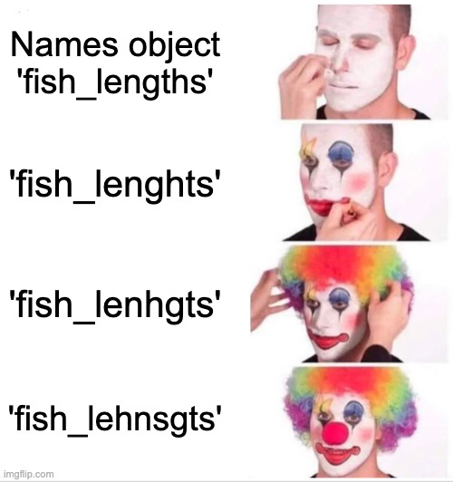
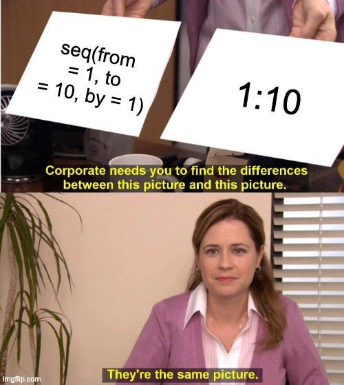
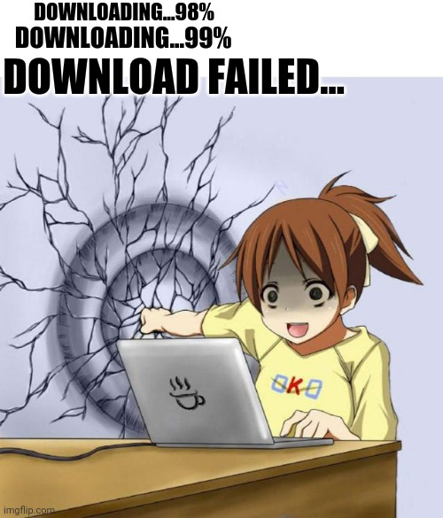

background-image: url("images/IMG_0743.jpg")
background-size: cover
class: center, top, inverse

# Introducing basic operations and functions in R

```{r xaringan-themer, include=FALSE, warning=FALSE}
### setup chunk
# load packages
library(xaringanthemer)
library(fontawesome)
library(emo)
library(tidyverse)
style_duo_accent_inverse(code_highlight_color = "#cc5500",
  primary_color = "#85D3D1",
  secondary_color = "#0D2A47",
  code_inline_color = "grey",
  inverse_background_color = "#85D3D1",
  inverse_text_color = "#0D2A47",
  code_inline_background_color = "#85D3D1",
  header_font_google = google_font("Josefin Sans"),
  text_font_google   = google_font("Montserrat", "300", "300i"),
  code_font_google   = google_font("Fira Mono"),
  colors = c(orange = "#cc5500",
         teal = "#85D3D1")
)
```

```{css, echo = FALSE}

.scrollable {
  height: 300px;
  overflow-y: auto;
}


.scrollable-auto {
  height: 75%;
  overflow-y: auto;
}

.remark-slide-scaler {
    overflow-y: auto;
}
```

---
# Basics
## Slide setup

Tips and explanations `r emo::ji("arrow_left")` this type of text contains prompts, tips, and tricks

.code-teal[
```{r, echo = TRUE}
# R code is delineated in these boxes
# hashmarks in R code are annotations, not functional code

"I am a penguin" # <- this is actual code
```
]

`r emo::ji("arrow_up")`   Code outputs appear below each chunk of code    `r emo::ji("arrow_up")`
---

## Access your workspace

To confirm that you're in the right place, you can write getwd() to get your working directory

```{r, echo = TRUE}
# use getwd() to find out where you are
getwd()
```

`r emo::ji("arrow_right")` If you're inside your project (as indicated on the upper right corner of your RStudio environment), your working directory should be automatically set to your project directory. 

`r emo::ji("arrow_right")` Think of your R-project as a box that contains everything you need to bake a cake. Within it, you may have smaller boxes that contain ingredients, instructions, or tools. 
---
## Packages `r emo::ji("package")`

R is user maintained, and most of its functionality comes from **packages** that contain a set of different functions to accomplish tasks. Some packages (such as the _base_ package) come pre-installed, but the vast majority of packages need to be installed and loaded.

Below, we are installing the _tidyverse_ package using the <span style="color:orange"> *install.packages()* </span> function 

```{r, echo = TRUE, results = 'hide'}
# you typically don't need to set repos when installing a package
install.packages("tidyverse", repos = "http://cran.us.r-project.org")
```

Installing the package downloads its contents to your R library. Before you can start using it, however, you have to load it into your current R session. We can do this using the <span style="color:orange"> *library()* </span> function.

```{r, echo = TRUE}
# load the tidyverse package in your current R session
library(tidyverse)
```

You only need to install packages once, but you will have to re-load the packages you need each time you start a new R session.
---
## Common operators

- "?" opens help
- "<-" assigns the right side to the left side
- "==" indicates whether the left side matches the right

.pull-left[ Getting help and assigning values

```{r, echo = TRUE, results='markup'}
# get help
?install.packages

# assign value
one <- 1
one

five <- 5
five
```
]

.pull-right[ Check for matches

```{r, echo = TRUE, results = 'markup'}
# check matching values (TRUE or FALSE)
5 == 5

5 == 6

five == 5

```
]
---
class: middle

## R as a calculator

- R works as a basic calculator, using the same annotation you would typically use. 

- It also understands a diverse range of mathematical functions as part of the _base_ package, such as <span style="color:orange"> *log()* </span>, <span style="color:orange"> *sqrt()* </span>, or <span style="color:orange"> *sin()* </span>  

```{r, echo = TRUE, results='markup'}
# four times four
4*4

# a much more complicated calculation
23*sin(19)/sqrt(12) + log(58)

# be careful to observe basic rules 
2 * 2 + 5 == 2 * (2 + 5)
```
---

## Naming objects


- you can name objects however you want, but misspelling names is one of the most common errors
- try to develop a standardized system for naming objects!
- for example, separate object names by "." or "_" and don't use capitals (e.g. "fish.data")

.pull-left[
```{r, echo = TRUE}
# assign obj1 the value of 4*4
obj1 <- 4*4
obj1
# assign obj2 a more complex value
obj2 <- 23/sqrt(58)*21^2
obj2
# assign obj3 a non-numerical value
obj3 <- "fish"
obj3
```
]

.pull-right[
```{r echo=FALSE, out.width="75%"}

```
]
---

## Combine objects

- you can readily combine numeric objects, but you cannot combine a numeric and non-numeric objects

```{r, echo = TRUE, results ='markup', error = TRUE}
obj4 <- obj1 + obj2 # combine numeric objects
obj4

obj5 <- obj1 + obj3 # attempt to combine numeric and character
```
`r emo::ji("cry")`

- to combine numbers and characters, you need to use a specialized function such as  <span style="color:orange"> *paste()* </span>

```{r, echo = TRUE, results='markup'}
obj6 <- paste(obj1,obj3) # using the paste function
obj6
```
---
class: inverse, center, top

# Exercise 1.1 `r emo::ji("weight_lifting_woman")`

### a) Find your current working directory.

### b) Test whether:

```{r, error = TRUE, echo = TRUE, results='hide'}
(6 * 1^3 + 1)^3 - (6 * 1^3 - 1)^3 - (6 *1^2)^3
``` 
### yields the same value as
```{r, error = TRUE, echo = TRUE, results='hide'}
(sin(2) + cos(2))^2 + (sin(2) - cos(2))^2
```

### c) Create an object that contains the text 'MCE', an object that contains the number 2024, and a new object that combines the two.   
---
class: center, top

# Solution 1.1a `r emo::ji("nerd_face")`

## a) Find your current working directory.
```{r Solution, error = TRUE, echo=TRUE}
getwd()
```
---
class: center, top
# Solution 1.1b `r emo::ji("nerd_face")`

## b) Compare the values of two equations
```{r, error = TRUE, echo = TRUE}
(6 * 1^3 + 1)^3 - (6 * 1^3 - 1)^3 - (6 *1^2)^3
(sin(2) + cos(2))^2 + (sin(2) - cos(2))^2
```

Alternatively, you can use the '==' operator

```{r, error = TRUE, echo = TRUE}
(6 * 1^3 + 1)^3 - (6 * 1^3 - 1)^3 - (6 *1^2)^3 == (sin(2) + cos(2))^2 + (sin(2) - cos(2))^2
```
---
class: center, top
# Solution 1.1c `r emo::ji("nerd_face")`

## c) Create 'MCE2024' from two objects named 'MCE' and '2024'

```{r, error = TRUE, echo = TRUE}
o1 <- "MCE"
o2 <- 2024
paste(o1, o2)
```
---
class: middle, center, inverse

# Functions and vectors
# `r emo::ji("gear")`

---
## Functions

- denoted by parentheses
- perform basic (or very sophisticated) operations with your objects
- you have already used them! `r emo::ji("light")`

```{r, echo = TRUE}
obj8 <- 9
sqrt(obj8) # sqrt() is a function

obj9 <- paste("fish", "23") # paste() is a function
obj9
```
---

## Vectors

- objects that contain multiple elements 
- simplest data structure in R

```{r, echo = TRUE, results='markup'}
conc.vals <- c(1,2,3,4,5) # c() is the concatenate function - use it to combine numbers
conc.vals # we have created a vector with five numbers

conc.text <- c("fish1", "fish2", "fish3", "fish4") # or use it to string together words
conc.text # we have created a vector with four words

conc.fish <- c("<º(((><", "<º(((><", "<º(((><") # you can concatenate almost anything
conc.fish
```
---
## Vectors `r emo::ji("handshake")` Functions 
### Create vectors using functions
- functions consist of **arguments** that need to be specified
- the <span style="color:orange"> *seq()* </span> function creates sequence vectors
- its basic arguments are **_from_**, **_to_**, and **_by_**

```{r, echo = TRUE, results = 'markup'}
seq1 <- seq(from = 1, to = 10, by = 1) # create a sequence from 1 to 10 in intervals of 1
seq1

seq2 <- seq(1, 10, 1) # you don't have to spell out arguments but it's safer to do so
seq2

seq3 <- 1:10 # with an easy sequence like this, you can also do this
seq3
```
---

.pull-left[
### There are often many ways to perform the same operation! `r emo::ji("clown")`

As the tasks at hand get more complex, you're less likely to find alternative pathways 

.scrollable[
```{r, echo = c(2,3), results='markup'}
options(width = 45)
seq4 <- seq(from = 0, to = 12167, by = 23)
seq4
```
]
]

.pull-right[
```{r echo=FALSE, out.width="95%"}

```
]
---
### Create vectors with repetitions
- the <span style="color:orange"> *rep()* </span> function creates repititions
- its basic arguments are **_x_** (the element to be replicated) and your choice of  **_times_** and/or **_each_** 


```{r, echo = (-1), results='markup'}
options(width = 100)
rep1 <- rep(1:5, times = 10) # replicate the sequence 1:5 ten times
rep1

rep2 <- rep(1:5, each = 10) # replicate each element in 1:5 ten times
rep2 # notice the difference between 'times' and 'each'

rep3 <- rep("fish", times = 8) # you can also repeat text
rep3
```
---
### Combining functions to create vectors

- you can use functions within functions (like the <span style="color:orange"> *seq()* </span> function within the <span style="color:orange"> *rep()* </span> function)
- there's no real limit to how many functions you can nest within each other (but going over board may get a little messy)

```{r, echo = TRUE, results='markup'}
rep4 <- rep(seq(from = 0, to = 10, by = 2), times = 3) # use seq() within rep() 
rep4 

mean.rep <- mean(rep(seq(from = 0, to = 10, by = 2), times = 3)) # use mean(), seq(), and rep()
mean.rep
```
---
### Performing functions on vectors

- as the previous operation suggests, you can use functions across vectors

```{r, echo = TRUE, results='markup'}
reps.comb <- c(rep2, rep4) # combine two numerical vectors
reps.comb

log.rep4 <- log(rep4) # take the log of rep2
log.rep4

reps.diff1 <- paste(rep2, rep3) # using paste() to combine vectors of different classes
reps.diff1 
```
---

### Elements within vectors
- you can isolate specific elements in your vectors using square brackets
```{r, echo = TRUE}
seq1 # call one of your vectors to see it

element3 <- seq1[3] # select only the third element
element3
```
- this also works for multiple elements at a time using the <span style="color:orange"> *c()* </span> function or ranges
```{r, echo = TRUE}
three.elements <- seq1[c(3,4,5)] # using c() to get elements 3, 4, and 5
three.elements

last.eight <- seq1[2:10] # using x:y to get the last 8 elements
last.eight
```
---
## Apply logic
- you can also extract values based on a condition with logical operators
- operators are pretty standard and works as below
- the '==' is a common source of error `r emo::ji('person_facepalming_medium_skin_tone')`


 ### Overview of common operators

Operator | Meaning
---------|---------
>= | values equal or greater
<= | values equal or smaller
> | values greater
< | values smaller
== | value equals
!= | value does not equal

---
## Logic in practice
- to demonstrate logic, we need a somewhat more complex vector
- we're creating this using one of the distributional functions, in this case a selection of integers using the <span style="color:orange"> *rpois()* </span> function
```{r, echo = TRUE, results='markup'}
random.vals <- rpois(30, lambda = 5) # create a new vector with 30 integers
random.vals

selected.vals <- random.vals[random.vals > 4] # select values that are greater than 4
selected.vals

values.not.6 <- random.vals[random.vals != 6] # select values that are not 6
values.not.6
```
- note that the [] requires you to re-specify the vector you want to use for the operation `r emo::ji('index_pointing_up')`

---
## Combining logical statements
- we can use Boolean expressions to combine logical statements
- three symbols: "&" = AND, "|" = OR, "!" = NOT
- can be applied separately and in combination
- NOT ("!") has precedence over AND ("&"), which has precedence over OR ("|")
```{r, echo = TRUE}
boolean.and <- random.vals[random.vals >= 4 & random.vals <= 8] # values between 4 and 8
boolean.and

boolean.or <- random.vals[random.vals == 3 | random.vals == 5] # values that are 3 or 5
boolean.or

boolean.not <- random.vals[random.vals != 4 & 
                             random.vals > 2 & 
                             random.vals < 8] # between 2 and 8 but not 4
boolean.not
```
---
## Assigning new values
- you can also replace values using the same principle
- works for single values and values selected by logic
```{r, echo = TRUE}
random.vals[1] <- 1000 # replace the first value of the vector with 1000
random.vals

random.vals[random.vals > 5] <- 1000 # replace values >5 with 1000
random.vals
```
---
## Non-numerical vectors `r emo::ji('tropical_fish')`
- vectors can also consist of different character strings
- same principles as for numbers apply, but logical operations are limited
```{r, echo = TRUE}
fish.comm <- paste(rep(c("whitefish", "bluefish", "yellowfish"), 5)) # create a vector of words
fish.comm

white.extinct <- fish.comm[fish.comm != "whitefish"] # remove whitefish
white.extinct

white.extinct[white.extinct == "yellowfish"] <- "greenfish" # replace yellowfish with greenfish
white.extinct
```
---
## Ordering vectors
- sometimes it's useful to sort and order your vectors
- this can be accomplished using the <span style="color:orange"> *sort()* </span> function
```{r, echo = TRUE}
more.vals <- rpois(20, 5) # use the rpois() function again to create a vector
more.vals

more.vals.sorted <- sort(more.vals) # use sort() to sort values in increasing order
more.vals.sorted

more.vals.sorted.dec <- rev(sort(more.vals)) # sort the values in decreasing order using "decreasing = TRUE" or the rev() function
more.vals.sorted.dec
```
---
## Missing data
- sometimes, vectors contain elements that aren't there or possible, called 'NAs'
- this is not always a problem, but can lead to errors in functions that need numeric values
```{r, echo = TRUE}
fish.numbers <- rpois(20, 5) # create vector with rpois()
fish.numbers

fish.numbers[c(5,15)] <- NA # replace some values with NAs
fish.numbers

fish.mean <- mean(fish.numbers) # calculate the mean fish number
fish.mean
```
## `r emo::ji('loudly_crying_face')`
- luckily, it is easy to remove NAs from some functions, or exclude them from your vector
```{r, echo = TRUE}
fish.mean.nona <- mean(fish.numbers, na.rm = TRUE) # na.rm = TRUE removes NAs within a function
fish.mean.nona

fish.mean.nona <- mean(fish.numbers[!is.na(fish.numbers)]) # !is.na(fish.density) excludes them from the vector prior to the function
fish.mean.nona
```
---
class: middle, center, inverse

# Data
# `r emo::ji("chart_decreasing")`

---
class: left, top


## Data classes

There are several different types of data classes in R

#### - numeric: all numbers `r emo::ji('abacus')`
#### - integer: whole numbers without decimals `r emo::ji('input_numbers')`
#### - logical: TRUE or FALSE (and NA) `r emo::ji('check')`
#### - character: character strings and factors (letters, symbols, numbers) `r emo::ji('input_latin_uppercase')` 
---

## Working with data classes

- it is absolutely critical to understand what class your data are
- mixups in data classes are a common source of error `r emo::ji('cross_mark')`

```{r, echo = TRUE}
numbers <- seq(1:20) # create vector of numbers

class(numbers) # find data class using class() or str()
str(numbers)

is.numeric(numbers) # check data class using "is" 

numbers.char <- as.character(numbers) # turn data into characters
numbers.char # note the quotes around the numbers
```
---
### Matrices
- there are several types of data structures in R
- scalars, vectors, matrices, lists, data frames, arrays
```{r, echo = TRUE}
scalar <- 23 # a single value is called a scalar
scalar

many.scalars <- rep(1:23, 2)  # a collection of scalars is a vector
many.scalars

the.matrix <- matrix(1:24, nrow = 4, byrow = FALSE) # when it has two dimensions, it's a matrix
the.matrix
```
---
### Rows and columns
- in two-dimensional arrangements, we can work with columns and rows
- for example, we can create a dataset of three fish species across six sites `r emo::ji('fish')` `r emo::ji('blowfish')` `r emo::ji('tropical_fish')`
- matrices can only hold one type of data (usually numeric)
```{r, echo = TRUE}
the.matrix <- matrix(rpois(18, 5), nrow = 6, byrow = FALSE) # create a matrix
the.matrix
colnames(the.matrix) <- c("bluefish", "blowfish", "yellowfish") # assign column names
rownames(the.matrix) <- c("site1", "site2", "site3", "site4", "site5", "site6") # assign row names
the.matrix
```
---
## Data frames
- to combine data of different classes, you need to turn it into a data.frame
- selecting elements within data.frames can be done using $ and [x,y]
```{r, echo = TRUE}
fish.df <- as.data.frame(the.matrix) # convert matrix to data frame
fish.df$blowfish # select a specific column using the $ sign 

fish.df[1,] # show the first row

locations <- c("Australia", "Indonesia", "Philippines", 
               "Fiji", "Solomons", "Papua New Guinea") # vector with 6 site locations
fish.df$location <- locations # add a character vector to a data frame
fish.df
```

---
## Tibbles
- tibbles are similar to data.frames but offer more information
```{r, echo = TRUE}
str(fish.df) # check structure of data frame

fish.tibble <- as_tibble(fish.df) # convert data frame to tibble

fish.tibble # view information provided by tibble
```
---
# Loading and saving data
- you'll often import your data from csv files or save them as such
- use the <span style="color:orange"> *write.csv()* </span> function to save a data frame or tibble in your working directory
- use the <span style="color:orange"> *read.csv()* </span> function to import data
```{r, echo = TRUE}
write.csv(fish.tibble, file = "data/fishtibble.csv", row.names = FALSE) # row.names = FALSE specifies to not include a column of row numbers in the csv

loaded.fish.tibble <- read.csv(file = "data/fishtibble.csv") # load that csv file back into R
loaded.fish.tibble
```
---
class: inverse, center, top

# Exercise 1.2 `r emo::ji("weight_lifting_woman")`

### a) Create a sequence of even numbers from 2 to 20

### b) Create a vector with random integer values using rpois(100, 10) and obtain its mean

### c) Retain only values <6 and calculate the mean again

### d) Download the dataset called "coralreefherbivores.csv" from the link below, and put it in your working directory in a folder called "data"

### e) Read in the data using the  <span style="color:orange"> *read_csv()* </span> function, specifying the correct path to the "data" folder

---
class: center, top
# Solution 1.2a `r emo::ji("nerd_face")`

## a) Create a sequence of even numbers from 2 to 20
```{r, echo = TRUE, error = TRUE}
s1 <- seq(from = 2, to = 20, by = 2)
```
---
class: center, top
# Solution 1.2b `r emo::ji("nerd_face")`

## b) Create a vector with random integer values using rpois(100, 10) and obtain its mean
```{r, echo = TRUE, error = TRUE}
v1 <- rpois(100, 10)
mean(v1)
```
---
class: center, top
# Solution 1.2c `r emo::ji("nerd_face")`
## c) Retain only values <6 and calculate the mean again
```{r, echo = TRUE, error = TRUE}
v2 <- v1[v1 < 6]
mean(v2)
```
---
class: center, top
# Solution 1.2d `r emo::ji("nerd_face")`

.pull-left[
## d) Download "coralreefherbivores.csv" to a folder called "data"
]

.pull-right[
```{r echo=FALSE, out.width="80%"}

```
]
---
class: center, top
# Solution 1.2e `r emo::ji("nerd_face")`
## e) Read in the data using the  <span style="color:orange"> *read_csv()* </span> function
```{r, echo = TRUE}
herbivores <- read.csv(file = "data/coralreefherbivores.csv")
```
---
class: center, middle
# The end
