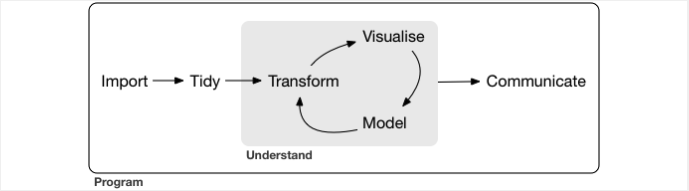
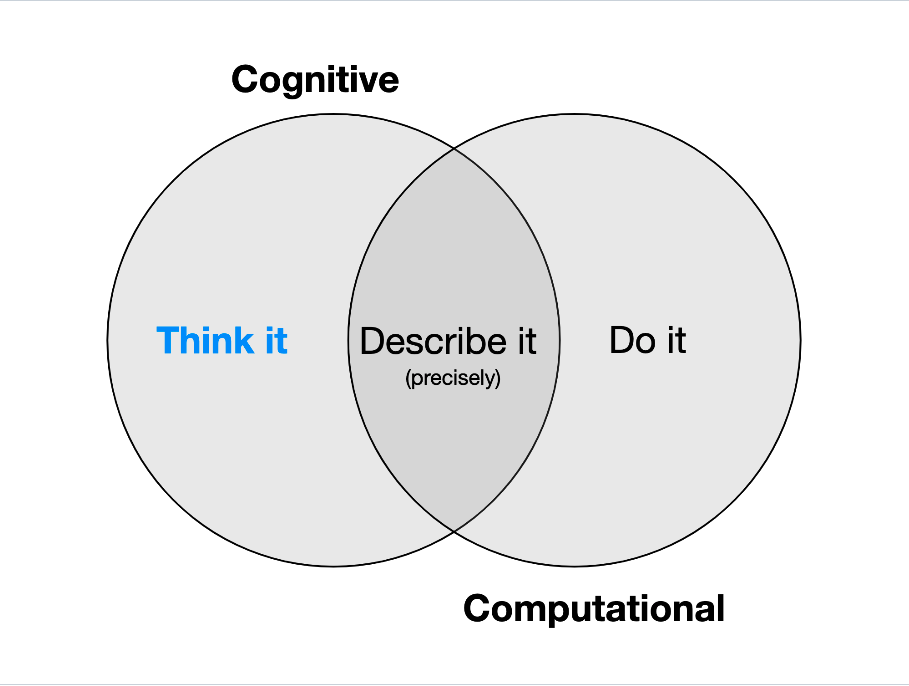
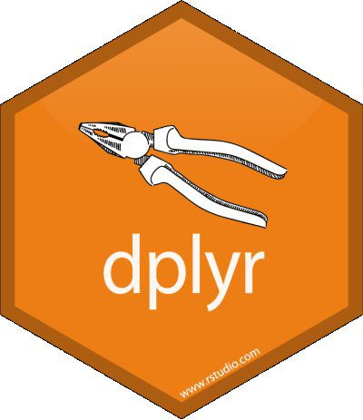
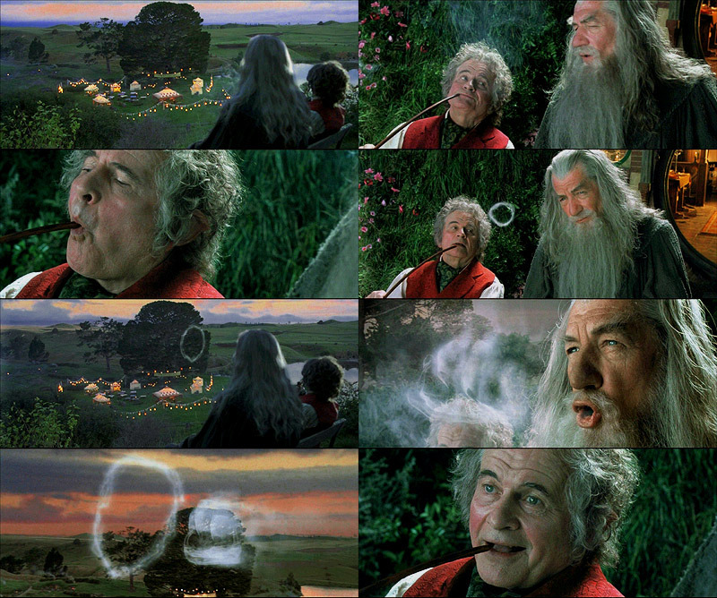
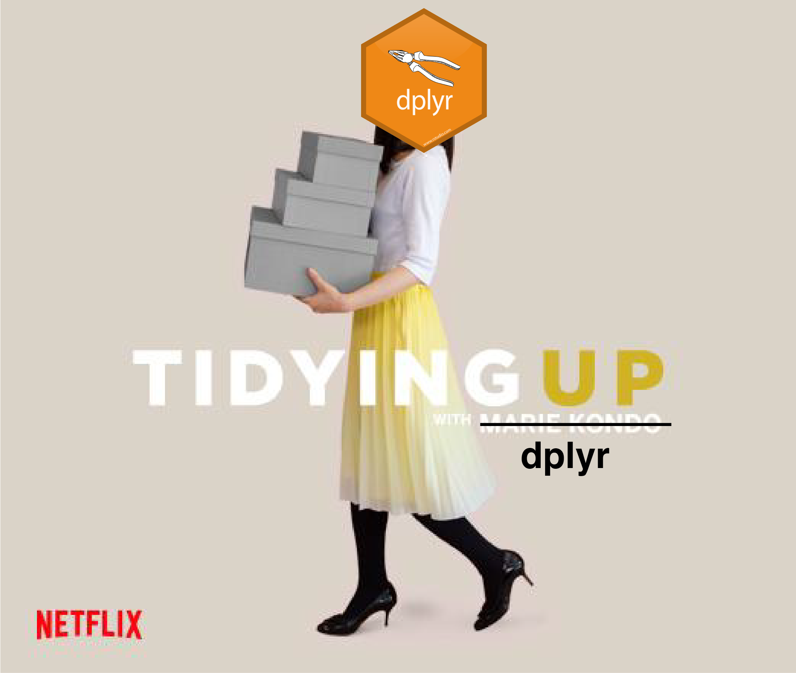

background-image: url("images/IMG_2100.jpg")
background-size: cover
class: center, top, inverse

# Data wrangling using dplyr and the tidyverse

```{r xaringan-themer, include=FALSE, warning=FALSE}
### setup chunk
# load packages
library(xaringanthemer)
library(fontawesome)
library(emo)
style_duo_accent_inverse(code_highlight_color = "#cc5500",
  primary_color = "#85D3D1",
  secondary_color = "#0D2A47",
  code_inline_color = "grey",
  inverse_background_color = "#85D3D1",
  inverse_text_color = "#0D2A47",
  code_inline_background_color = "#85D3D1",
  header_font_google = google_font("Josefin Sans"),
  text_font_google   = google_font("Montserrat", "300", "300i"),
  code_font_google   = google_font("Fira Mono"),
  colors = c(orange = "#cc5500",
         teal = "#85D3D1")
)
```

```{css, echo = FALSE}

.scrollable {
  height: 300px;
  overflow-y: auto;
}


.scrollable-auto {
  height: 75%;
  overflow-y: auto;
}

.remark-slide-scaler {
    overflow-y: auto;
}
```

---
# The tidyverse `r emo::ji("dizzy")`

- the tidyverse contains a vast number of functions to process data

- concept by Hadley Wickham: intuitive, simple way to do data science

```{r echo=FALSE, out.width="100%"}

```

---
## What is tidy data? `r emo::ji("broom")`

- data that is easy to transform, visualize, and model

- variables are always columns, rows are always data

- functions are meant to be intuitive

.pull-right[
```{r echo=FALSE, out.width="50%"}

```
]
---
## The dplyr/tidyverse package `r emo::ji("wrench")`

.pull-left[
- the core package for tidy data processing is the **dplyr** package

- the **dplyr** package is part of the **tidyverse** package, which includes several other packages

```{r, echo = T, warning=FALSE, results='hide'}
library(dplyr)
library(tidyverse)
```
]

.pull-right[
```{r echo=FALSE, out.width="75%"}

```
]

---

class: center, middle

## Five workhorse functions `r emo::ji("horse")`

**1) <span style="color:orange"> filter()</span>: keep/remove rows based on criteria**

**2) <span style="color:orange"> select()</span>: keep/remove columns by name/number/sequence**

**3) <span style="color:orange"> mutate()</span>: add new variables**

**4) <span style="color:orange"> summarize()</span>: reduce variables to summarized values**

**5) <span style="color:orange"> arrange()</span>: reorder rows**

## `r emo::ji("scissors")` `r emo::ji("hammer")` `r emo::ji("magnet")` `r emo::ji("clamp")` `r emo::ji("nut_and_bolt")`
---

## Pipes

.pull-left[
- pipes are a special type operator, implemented using <span style="color:orange">**%>%**</span>

- pipes allow you to construct a sequence of actions with the same dataset

- for example, we can create a vector and take its mean 

```{r, echo = TRUE}
v1 <- rnorm(1000, 0, 5) %>% # creating a vector using rnorm() and piping it
  mean() # taking the mean
v1
```
]

.pull-right[
```{r echo=FALSE, out.width="80%"}

```
]
---
## Preparation

- we'll start by reading in our fish.tibble that we created previously 

- the .csv file should be in your data directory - if not, you can download it [here](https://simonjbrandl.github.io/marinecommunityecology/2-tidyverse.html)

```{r, echo = TRUE}
fish.tibble <- read.csv(file = "data/fishtibble.csv") 
fish.tibble
```
---
class: center, middle, inverse
# Filter
# `r emo::ji("magnet")`
---
### Basic filtering

- The <span style="color:orange"> *filter()* </span> function let's you select or remove rows based on characters or values

```{r, echo = TRUE, results='markup'}
fish.tbl.filtered <- fish.tibble %>% # create a new object from fish.tibble and pipe it
  filter(location == "Australia") # filter rows for Australia
fish.tbl.filtered

fish.tbl.filtered2 <- fish.tibble %>%
  filter(location == c("Australia", "Indonesia")) # use multiple criteria using c()
fish.tbl.filtered2

fish.tbl.filtered3 <- fish.tibble %>%
  filter(blowfish > 3) # filter by values greater than 5 in the blowfish column
fish.tbl.filtered3
```
---
### Advanced filtering

- we can apply the same logical expressions we learned previously

```{r, echo = TRUE, results='markup'}
fish.tbl.filtered4 <- fish.tibble %>%
  filter(yellowfish > 3 & yellowfish < 7) # filter by values greater than three and smaller than 8
fish.tbl.filtered4

# filter across multiple columns, numeric, character, and c()
fish.tbl.filtered5 <- fish.tibble %>%
  filter(bluefish > 5 & location != c("Fiji", "Australia")) 
fish.tbl.filtered5
```
---
class: center, middle, inverse
# Select
# `r emo::ji("ballot_box_with_check")`
---
### Basic selecting (for or against)

- the <span style="color:orange"> *select()* </span> function allows you to keep columns in your dataset based on names, positions, or criteria

```{r, echo = TRUE}
fish.tbl.select <- fish.tibble %>% # retain the columns blowfish and location
  select(blowfish, location)
fish.tbl.select

fish.tbl.select2 <- fish.tibble %>%
  select(-bluefish, -blowfish) # remove the bluefish and blowfish columns
fish.tbl.select2
```
---
### Selecting using positions or criteria

- by using a - sign, you can de-select columns from your dataset

- you can also employ criteria for negative or positive selection using

```{r, echo = TRUE}
fish.tbl.select3 <- fish.tibble %>% # retain only the third and fourth column
  select(3:4)
fish.tbl.select3

fish.tbl.select4 <- fish.tibble %>%
  select(-ends_with("fish")) # remove all columns that end with fish
fish.tbl.select4
```
---
class: center, middle, inverse
# Mutate
# `r emo::ji("bug")`  `r emo::ji("butterfly")`
---
### Using mutate to create new columns
- the <span style="color:orange"> *mutate()* </span> function basically creates new columns

- most commonly, we'll use <span style="color:orange"> *mutate()* </span> to create columns based on existing columns'

- in the simplest scenario, we can create columns from scratch equivalent to the <span style="color:orange"> *add_column()* </span> function

```{r, echo = TRUE}
fish.tbl.mutate <- fish.tibble %>%
  mutate(greyfish = c(0,2,4,6,8,10), # add another numeric column called greyfish 
         type = c("continental", # and a categorical variable called type
                  "continental", 
                  "continental", 
                  "oceanic", 
                  "oceanic", 
                  "continental"))
fish.tbl.mutate
```
- hint: you can use the <span style="color:orange"> *relocate()* </span> function to tidy up your dataset

---
### Using mutate on existing columns

- we can use <span style="color:orange"> *mutate()* </span> for basic mathematical operations or combining columns

```{r, echo = TRUE}
fish.tbl.mutate2 <- fish.tbl.mutate %>%
  mutate(totalfish = bluefish+blowfish+yellowfish+greyfish) %>% # sum acrcoss fish species 
  relocate(location, type) # relocate for tidyness
fish.tbl.mutate2

fish.tbl.mutate3 <- fish.tbl.mutate2 %>%
  mutate(loc_type = paste(location, type, sep = ".")) # combine the two character columns
fish.tbl.mutate3
```
- hint: check out the <span style="color:orange"> *unite()* </span> function
---
### Using mutate to replace and transform

- you can use mutate to replace character strings or transform numbers

```{r, echo = TRUE}
fish.tbl.mutate4 <- fish.tbl.mutate3 %>%
  mutate(type.recode = recode(type, continental = "coastal")) # use recode() within mutate to replace characters
fish.tbl.mutate4

new.fish.tbl <- fish.tbl.mutate3 %>%
  mutate(log_totalfish = log(totalfish)) # create a column with the log of totalfish
new.fish.tbl
```
---
class: center, middle, inverse
# Summarize
# `r emo::ji("memo")`
---
### Summarizing across rows 

- the <span style="color:orange"> *summarize()* </span> function turns many row values into one by performing some kind of mathematical operation
```{r, echo = TRUE, warning=FALSE} 
sum.blowfish <- new.fish.tbl %>% 
  summarize(mean.blowfish = mean(blowfish), # get the mean, sd, min and max
            sd.blowfish = sd(blowfish), 
            min.blowfish = min(blowfish),
            max.blowfish = max(blowfish))
sum.blowfish

sum.blueblow <- new.fish.tbl %>%
  summarize(mean.blowfish = mean(blowfish), # means for two columns
            mean.bluefish = mean(bluefish))
sum.blueblow

range.total <- new.fish.tbl %>%
  summarize(range.total = range(totalfish), # range and quantiles for totalfish
            quant.total = quantile(totalfish, c(0.05, 0.95)))
range.total
```

---
class: middle, center, inverse
# Arrange
# `r emo::ji("twisted_rightwards_arrows")`
---
### Arranging columns

- the <span style="color:orange">arrange()</span> function takes the place of the sort function from base R

- NAs will always go to the bottom of the column

```{r, echo = TRUE}
fish.tbl.order <- new.fish.tbl %>%
  arrange(type) # arrange by type
fish.tbl.order

fish.tbl.order.total <- new.fish.tbl %>%
  arrange(-totalfish) # arrange by totalfish, descending
fish.tbl.order.total

fish.tbl.order.NA <- new.fish.tbl %>%
  mutate(na.fish = c(1, 2, 3, NA, 5, 6)) %>% # create column with NAs
  arrange(na.fish) %>% # arrange data by na.fish (ascending)
  relocate(na.fish)
fish.tbl.order.NA
```
---
class: inverse, center, top

# Exercise 2.1 `r emo::ji("weight_lifting_woman")`

### Read in your fishtibble.csv file and perform the following:

### a) Remove the values for the Philippines

### b) Retain only the first two columns

### c) Create a new column that contains the ratio of bluefish to blowfish

### d) Obtain the variance in bluefish, blowfish, and yellowfish

### e) Sort your dataset in the reverse alphabetical order of locations

---
class: center, top
# Solution 2.1a `r emo::ji("nerd_face")`

## a) Remove the values for the Philippines
```{r, echo = TRUE, error = TRUE}
fish.tibble <- read.csv(file = "data/fishtibble.csv")
a <- fish.tibble %>%
  filter(location != "Philippines")
a
```
---
class: center, top
# Solution 2.1b `r emo::ji("nerd_face")`

## b) Retain only the first two columns
```{r, echo = TRUE, error = TRUE}
b <- fish.tibble %>%
  select(1:2)
b
```
---
class: center, top
# Solution 2.1c `r emo::ji("nerd_face")`

## c) Create a new column that contains the ratio of bluefish to blowfish
```{r, echo = TRUE, error = TRUE}
c <- fish.tibble %>%
  mutate(ratio = bluefish/blowfish)
c
```
---
class: center, top
# Solution 2.1d `r emo::ji("nerd_face")`

## d) Obtain the variance in bluefish, blowfish, and yellowfish
```{r, echo = TRUE}
d <- fish.tibble %>%
  summarize(var_blue = var(bluefish),
            var_blow = var(blowfish),
            var_yell = var(yellowfish))
d
```
---
class: center, top
# Solution 2.1e `r emo::ji("nerd_face")`

## e) Sort your dataset in the reverse alphabetical order of locations
```{r, echo = TRUE}
e <- fish.tibble %>%
  arrange(desc(location))
e
```
---
class: center
```{r echo=FALSE, out.width="60%"}

```
---
class: center, middle

## Auxilliary functions `r emo::ji("hammer")`

**1) <span style="color:orange"> group_by()</span>: perform actions across rows with the same factor level**

**2) <span style="color:orange"> join()</span>: combine datasets based on an overlapping column**

**3) <span style="color:orange"> gather()</span>: compile rows from many columns into a single column**

**4) <span style="color:orange"> spread()</span>: distribute rows from a single column into many columns**

**5) <span style="color:orange"> case_when()</span>: apply advanced conditional logic to your mutate statements**

---
class: center, middle, inverse
# group_by()
# `r emo::ji("busts_in_silhouette")` 
---
### Grouping rows by factor levels

- the <span style="color:orange"> group_by()</span> creates an internal group structure

- groupings are now indicated for tibbles

```{r, echo = TRUE}
fish.tbl.grouped <- new.fish.tbl %>%
  group_by(type) # group by type
fish.tbl.grouped # dataset looks the same, but it will behave differently due to grouping

fish.tbl.sum <- fish.tbl.grouped %>%
  summarize(mean.fish <- mean(totalfish)) # add summarize() to see new behavior
fish.tbl.sum
```
---
### Advanced grouping and ungrouping

- we can group by multiple arguments

- grouping creates a legacy that can mess things up downstream, which we can resolve using <span style="color:orange"> ungroup()</span>

```{r, echo = TRUE}
fish.tbl.sum2 <- new.fish.tbl %>%
  mutate(region = c("Oceania", "Asia", "Asia", "Oceania", "Asia", "Asia")) %>% # create another variable
  group_by(region, type) %>% # group by type and region
  summarize(mean.fish <- mean(totalfish)) # add summarize() to see new behavior
fish.tbl.sum2

fish.tbl.sum3 <- fish.tbl.grouped %>%
  ungroup() %>% # remove grouping structure
  summarize(mean.fish <- mean(totalfish)) 
fish.tbl.sum3
```
---
class: center, middle, inverse
# Join
# `r emo::ji("handshake")` 
---
### Joining datasets

- there are four ways of using the function

1) <span style="color:orange">left_join()</span>: retains all elements on the left side of the equation

2) <span style="color:orange">right_join()</span>: retains all elements on the right side of the join equation

3) <span style="color:orange">inner_join()</span>: only joins elements that match

4) <span style="color:orange">full_join()</span>: retains everything

- to explore these functions, let's get some additional data
- the **wpp2019** package includes a dataset called "pop" with global population sizes by country

```{r, echo = TRUE}
library(wpp2019) # load the package
data(pop) 
str(pop)
```
---
### Joining in practice

- we are trying to include population sizes from 2020 to countries in our fish.tibble

```{r, echo = T}
pop.2020 <- pop %>% 
  select(name, "2020") %>% #  select the name column and the 2020 column
  rename(location = "name", # use the rename() function to match the name in our fish.tibble
         population = "2020") # rename 2020 to 'population' - numbers in columns are a bad idea
head(pop.2020)


# Solomons does not exist in the pop dataset, so it gives "NA" for population size
fish.tibble.left.join <- fish.tibble %>% 
  left_join(pop.2020, by = "location") # use left_join() to merge pop.2020 into the fish.tibble
fish.tibble.left.join

# use inner_join() to join pop and fish.tibble datasets, only joining locations that match
# Solomons is now excluded from the dataset
fish.tibble.inner.join <- fish.tibble %>%
  inner_join(pop.2020)
fish.tibble.inner.join
```
---
class: center, middle, inverse
# Gather
# `r emo::ji("basket")`
---
### Gathering rows from multiple columns

- the <span style="color:orange">gather()</span> function turns data from wide format into long format

- this is extremely useful, as it allows us to use <span style="color:orange">group_by()</span> for our newly created variable

```{r}
fish.gathered <- fish.tibble.inner.join %>%
  gather(1:3, # specify the columns that include the data frame
         key = "fish_species", value = "number") # provide names of new key and value columns 
head(fish.gathered)

fish.means <- fish.gathered %>%
  group_by(fish_species) %>% # this is the newly created, gathered variable
  summarize(mean.fish = mean(number),
            sd.fish = sd(number))
fish.means
```
---
class: center, middle, inverse
# Spread
# `r emo::ji("bagel")`
---
### Spreading rows into columns

- the <span style="color:orange">spread()</span> function does the inverse of <span style="color:orange">gather()</span>

- problems can arise when there are missing observations

```{r}
fish.spread <- fish.gathered %>%
  spread(key = fish_species, value = number) # convert the data back into a wide format
fish.spread

fish.spread2 <- fish.gathered %>%
  filter(number != 3) %>% # let's remove all rows that have the value 3
  spread(key = fish_species, value = number, fill = 0) # fill them with 0s
fish.spread2
```
---
class: center, middle, inverse
# case_when
# `r emo::ji("face_with_monocle")`
---
### Advanced logic within <span style="color:orange">mutate()</span>

- the <span style="color:orange">case_when()</span> function lets you apply logic within <span style="color:orange">mutate()</span>

- this is _extremely_ useful, but can take a while to get the hang of

```{r, echo = T}
fish.spread.case <- fish.spread %>%
  mutate(pop.cat = case_when(population > 10000 ~ "high", # high or low 
                             TRUE ~ "low"))

fish.spread.case
```
---
background-image: url("images/slineatus_2.jpg")
background-size: cover
class: left, top

### Create the following vector:

```{r}
families <- data.frame("Families" = as.character(c("Acanthuridae", "Kyphosidae", "Labridae", "Siganidae")),
                       "Common" = as.character(c("surgeonfishes", "chubs", "parrotfishes", "rabbitfishes")))
```
---
class: inverse
# Exercise 2.2 `r emo::ji("weight_lifting_woman")`

### a) Read in the 'coralreefherbivores.csv' dataset and obtain the mean bodydeph across  families

### b) Integrate the common names for each family into the dataset

### c) Compile sl, bodydepth, snoutlength, and eyediameter into a single column called "morphometrics"

### d) Reverse the previous action

### e) Create a new column called "googly_eyed" where all species that have an eyediameter >=0.3 are tagged as "googly" and those with eyediameters <0.3 as "notgoogly"
---
class: center, top
# Solution 2.2a `r emo::ji("nerd_face")`

### a) Obtain the mean bodydeph across different families
```{r, echo = TRUE, error = TRUE}
herbs <- read.csv(file = "data/coralreefherbivores.csv")
a <- herbs %>%
  group_by(family) %>%
  summarize(mean.bd = mean(bodydepth))
head(a)
```
---
class: center, top
# Solution 2.2b `r emo::ji("nerd_face")`

### b) Integrate the common names for each family into the dataset
```{r, echo = TRUE, error = TRUE}
b <- families %>%
  rename(family = "Families") %>%
  inner_join(herbs)
head(b)
```
---
class: center, top
# Solution 2.2c `r emo::ji("nerd_face")`

### c) Compile the values for sl, bodydepth, snoutlength, and eyediameter into a single column called "measurement", with a variable called "category" as the key
```{r, echo = TRUE, error = TRUE}
c <- herbs %>%
  gather(5:8, key = "category", value = "measurement")
head(c)
```
---
class: center, top
# Solution 2.2d `r emo::ji("nerd_face")`

### d) Reverse the previous action
```{r, echo = TRUE}
d <- c %>%
  spread(key = "category", value = "measurement")
head(d)
```
---
class: center, top
# Solution 2.2e `r emo::ji("nerd_face")`

### e) Create a new column called "googly_eyed" based on eyediameter
```{r, echo = TRUE}
e <- herbs %>%
  mutate(googly_eyed = case_when(eyediameter >= 0.3 ~ "googly",
                                 TRUE ~ "notgoogly"))
head(e)
```
---
background-image: url("images/ggplot_hive.jpg")
background-size: cover
class: center, top, inverseclass: inverse, center, top
---
class: center, middle
# The end
