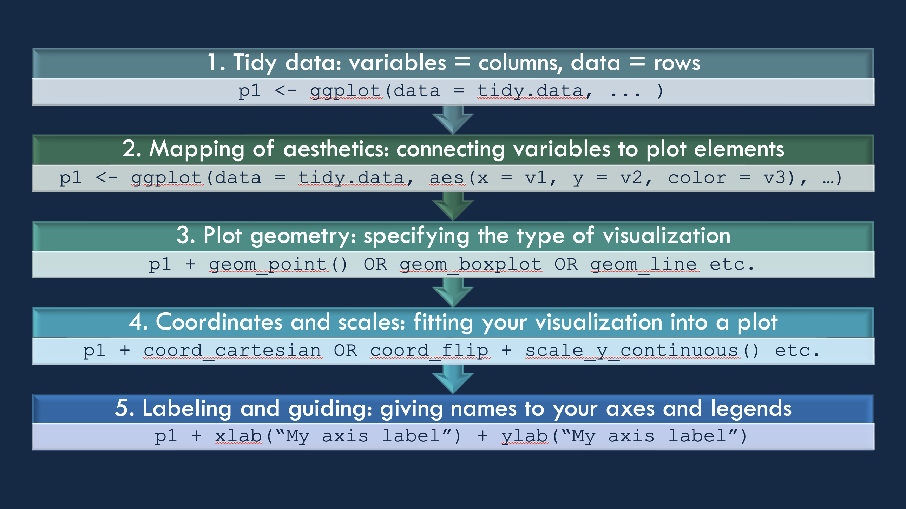
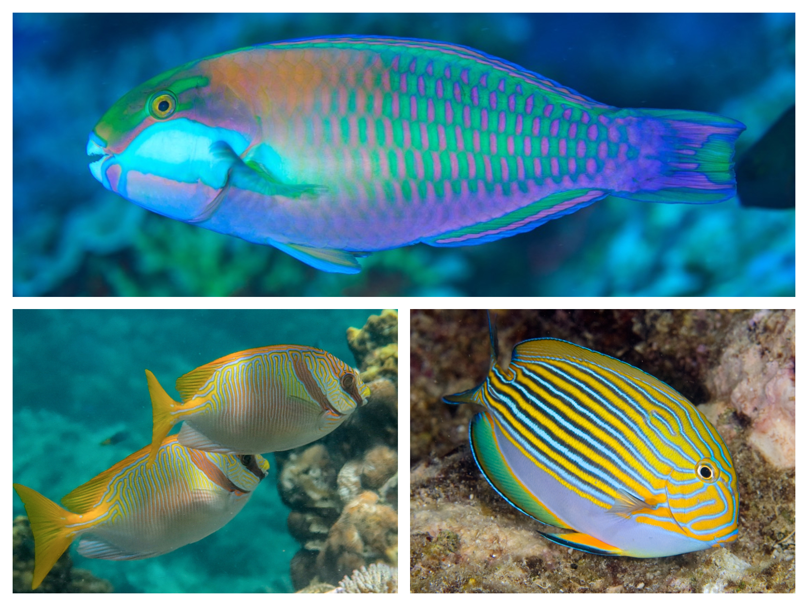
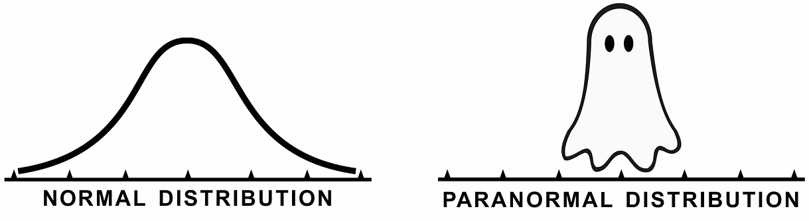
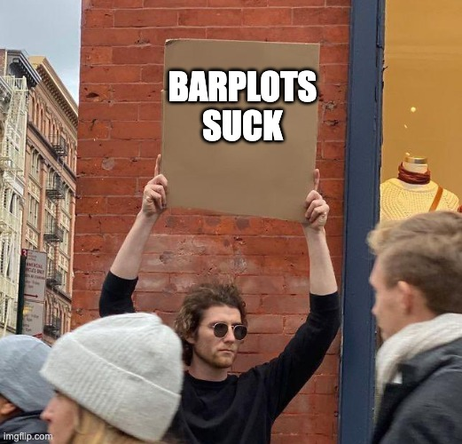
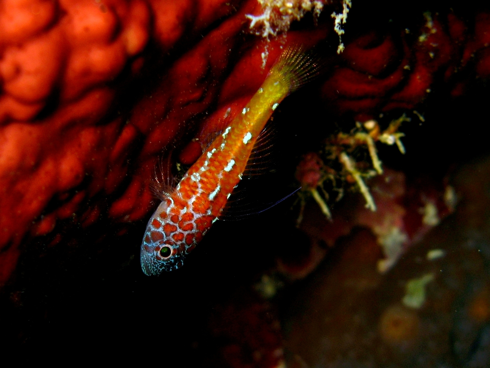

background-image: url("images/Priolepis.png")
background-size: cover
class: center, top

# Plotting data using ggplot2

```{r xaringan-themer, include=FALSE, warning=FALSE}
### setup chunk
# load packages
library(xaringanthemer)
library(fontawesome)
library(emo)
style_duo_accent_inverse(code_highlight_color = "#cc5500",
  primary_color = "#85D3D1",
  secondary_color = "#0D2A47",
  code_inline_color = "grey",
  inverse_background_color = "#85D3D1",
  inverse_text_color = "#0D2A47",
  code_inline_background_color = "#85D3D1",
  header_font_google = google_font("Josefin Sans"),
  text_font_google   = google_font("Montserrat", "300", "300i"),
  code_font_google   = google_font("Fira Mono"),
  colors = c(orange = "#cc5500",
         teal = "#85D3D1")
)
```

```{css, echo = FALSE}

.scrollable {
  height: 300px;
  overflow-y: auto;
}


.scrollable-auto {
  height: 75%;
  overflow-y: auto;
}

.remark-slide-scaler {
    overflow-y: auto;
}
```

---
# The ggplot package `r emo::ji("artist_palette")`

.pull-left[
- stands for 'Grammar of Graphics'

- offers an extremely versatile set of functions to create beautiful data visualizations

- works with layers: data, aesthetics, geoms, axes, descriptions
]

.pull-right[
```{r echo=FALSE, out.width="75%"}
knitr::include_graphics("images/ggplot2.png")
```
]
---
## The basic concept
```{r echo=FALSE, out.width="100%"}

```

---
## The ggplot2 package `r emo::ji("package")`

.pull-left[
- the core package for tidy data processing is the **ggplot2** package

- there are many auxiliary packages that include specialized geoms, functions, etc., such as **ggridges**, **GGally**, or **ggeffects**

- other packages integrate with ggplot such as **patchwork** or **fishualize** `r emo::ji("heart_eyes")`
]

.pull-right[ .center[ .top[
```{r echo=FALSE, out.width="40%"}
knitr::include_graphics("images/fishualize_logo.png")
```
]]]

```{r, echo = T, warning=FALSE, results='hide'}
#install.packages("ggplot2", repos = "http://cran.us.r-project.org")
#install.packages("ggridges", repos = "http://cran.us.r-project.org")
#install.packages("fishualize", repos = "http://cran.us.r-project.org")
#install.packages("patchwork", repos = "http://cran.us.r-project.org")

library(ggplot2)
library(tidyverse)
library(patchwork)
library(fishualize)
library(ggridges)
```
---
## Preparation

Let's read in datasets to use with our ggplot exploration 

```{r, echo = TRUE}
herbivore.traits <- read.csv(file = "data/coralreefherbivores.csv") 
head(herbivore.traits)
reef.fish <- read.csv(file = "data/reef_fishes.csv")
head(reef.fish)
```
---
class: center, middle, inverse
# Getting started
---

## The <span style="color:orange">ggplot()</span> function

.pull-left[
- the <span style="color:orange">ggplot()</span> function will create your base layer

- you can think of this as a blank canvas

- not very exciting, but it's a start

```{r, echo = TRUE}
p1 <- ggplot()
```

]

.pull-right[ .center[
```{r, echo = F}
p1
```
]]
---
## Adding data `r emo::ji("chart_increasing")`

.pull-left[
- you can add data using the 'data()' argument

- this doesn't actually change anything in how the plot looks, but it directs the function to the dataset to use for all other arguments

```{r, echo = TRUE}
# use the herbivore.traits dataset
p1 <- ggplot(data = herbivore.traits)
```

]

.pull-right[ .center[
```{r, echo = F}
p1
```
]]

---
## Specifying aesthetics using aes()

.pull-left[
- aesthetics in ggplot (specified with the aes() argument) clarify which columns hold the information and how you want to use it

- let's say we want to look at the relationship between herbivore body depth (x) and eye diameter (y)

- as you can see, we now get axes on our graph that reflect our variables of interest

```{r, echo = TRUE}
p1 <- ggplot(data = herbivore.traits, 
             aes(x = bodydepth, 
                 y = eyediameter))
```

]

.pull-right[ .center[
```{r, echo = F}
p1
```
]]
---
## Adding geoms: scatterplots

.pull-left[
- with the blank canvas, the source data, and the aesthetics in place, we can actually show the patterns in the data

- since we're interested in a relationship between two continuous variables, we will use a scatterplot with geom_point()

- we can add and modify geoms by using **+** after each line

```{r, echo = TRUE}
p1 <- ggplot(data = herbivore.traits, 
             aes(x = bodydepth, 
                 y = eyediameter)) +
  geom_point()
```

- not exactly a work of art, but informative no less `r emo::ji("smiling_face_with_sunglasses")`
]

.pull-right[ .center[
```{r, echo = F}
p1
```
]]
---
## Adjusting visual elements

.pull-left[
- we can easily modify the size, shape, and color of the plotted points

```{r, echo = TRUE}
# size changes size of the point
# shape changes the shape of the point
# color changes the color of the point
p1 <- ggplot(data = herbivore.traits, 
             aes(x = bodydepth, 
                 y = eyediameter)) +
  geom_point(size = 5, 
             shape = 18, 
             color = "blue")
```


]

.pull-right[ .center[
```{r, echo = F}
p1
```
]]
---
## Mapping groups onto geoms

.pull-left[
- it's often useful to use colors, shapes, or sizes to display group membership

- we can map groups onto geoms, but need to use the aes() mapping function

- this can be done either in the main aes() mapping or for each specific geom

```{r, echo = TRUE}
p1 <- ggplot(data = herbivore.traits, 
             aes(x = bodydepth, 
                 y = eyediameter,
# group membership assigned here
                 color = family)) + 
  geom_point(size = 5, 
             shape = 18) 
# no color argument here
```
]

.pull-right[ .center[
```{r, echo = F}
p1
```
]]
---
## Multiple group aesthetics

.pull-left[
- we can use shapes, sizes, colors, or fills to indicate different group memberships

```{r, echo = TRUE}
p1 <- ggplot(data = herbivore.traits, 
             aes(x = bodydepth, 
                 y = eyediameter,
                 color = family,
# added shape = size
                 shape = size)) + 
  geom_point(size = 5) 
# removed shape argument here
```
]

.pull-right[ .center[
```{r, echo = F}
p1
```
]]
---
## Continuous group aesthetics

.pull-left[
- we can include a third continuous variable on the plot

- including more information isn't always better: this is a very busy plot

```{r, echo = TRUE}
p1 <- ggplot(data = herbivore.traits, 
             aes(x = bodydepth, 
                 y = eyediameter,
                 color = family,
                 shape = size,
# including sl as a continuous variable
                 size = sl)) +
  geom_point()
```
]

.pull-right[ .center[
```{r, echo = F}
p1
```
]]

---
## Facets

.pull-left[
- if there is too much information for one panel, we can tell ggplot to create multiple panels

- this is done using the facet_grid() or facet_wrap() argument

```{r, echo = TRUE}
p1 <- ggplot(data = herbivore.traits, 
             aes(x = bodydepth, 
                 y = eyediameter,
                 color = family,
                 shape = size,
                 size = sl)) +
  geom_point() +
  facet_wrap(. ~ family) 
```
]

.pull-right[ .center[
```{r, echo = F}
p1
```
]]
---
class: center, middle
```{r echo=FALSE, out.width="75%"}
knitr::include_graphics("images/honest_work.jpeg")
```
---
class: inverse, center, top

# Exercise 3.1 `r emo::ji("weight_lifting_woman")`

## Read in your coralreefherbivores.csv file and perform the following:


### a) Create a scatterplot with ggplot2 where x = 'sl' and y = 'bodydepth'

### b) Change the points to be black triangles (shape = 17) with size 4

### c) Change the color of the points to reflect different genera

### d) Break up the graph into panels based on sizeclasses

---
class: center, top
# Solution 3.1a `r emo::ji("nerd_face")`

.pull-left[
```{r, echo = TRUE, error = TRUE}
p2 <- ggplot(data = herbivore.traits, 
             aes(x = sl, 
                 y = bodydepth)) +
  geom_point()
```
]

.pull-right[ .center[
```{r, echo = F}
p2
```
]]

---
class: center, top
# Solution 3.1b `r emo::ji("nerd_face")`

.pull-left[
```{r, echo = TRUE, error = TRUE}
p2 <- ggplot(data = herbivore.traits, 
             aes(x = sl, 
                 y = bodydepth)) +
  geom_point(shape = 17,
             size = 4)
```
]

.pull-right[ .center[
```{r, echo = F}
p2
```
]]
---
class: center, top
# Solution 3.1c `r emo::ji("nerd_face")`

.pull-left[
```{r, echo = TRUE, error = TRUE}
p2 <- ggplot(data = herbivore.traits, 
             aes(x = sl, 
                 y = bodydepth,
                 color = genus)) +
  geom_point(shape = 17,
             size = 4)
```
]

.pull-right[ .center[
```{r, echo = F}
p2
```
]]
---
class: center, top
# Solution 3.1d `r emo::ji("nerd_face")`

.pull-left[
```{r, echo = TRUE, error = TRUE}
p2 <- ggplot(data = herbivore.traits, 
             aes(x = sl, 
                 y = bodydepth,
                 color = genus)) +
  geom_point(shape = 17,
             size = 4) +
  facet_wrap(.~size)
```
]

.pull-right[ .center[
```{r, echo = F}
p2
```
]]
---
class: center, middle, inverse
# Summarizing data `r emo::ji("bar_chart")`
---
## Data within groups

.pull-left[

- let's re-investigate the plot we made earlier

- if we focus on the y-axis, we see that that there may be a difference in eye diameter among the four families

```{r echo=FALSE, out.width="100%"}

```

]

.pull-right[ .center[
```{r, echo = F}
p1
```
]]
---
## Categorical axes

.pull-left[

- we can get a better sense for differences among groups by including a categorical axis

- this is very simple: you just need to specify a categorical column in aes()

```{r, echo = TRUE}
p3 <- ggplot(data = herbivore.traits, 
             aes(x = family, 
                 y = eyediameter,
                 color = family)) +
  geom_point()
```

- it's not the best way of visualizing it
]

.pull-right[ .center[
```{r, echo = F}
p3
```
]]
---
## Jittering points

.pull-left[

- one way of making the plot clearer is by slightly adjusting ('jittering') each point

- this can be achieved using geom_jitter() instead of geom_point() `r emo::ji("beetle")`

```{r, echo = TRUE}
p3 <- ggplot(data = herbivore.traits, 
             aes(x = family, 
                 y = eyediameter,
                 color = family)) +
  geom_jitter(width = 0.1)
# specify the width you want to use
```
]

.pull-right[ .center[
```{r, echo = F}
p3
```
]]
---
## Boxplots

.pull-left[

- while jittering makes it easier to see, it is much better to visualize actual distributions in the four families 

- the easiest way of accomplishing this is with a boxplot `r emo::ji("bar_chart")`

```{r, echo = TRUE}
p3 <- ggplot(data = herbivore.traits, 
             aes(x = family, 
                 y = eyediameter,
                 color = family)) +
  geom_boxplot()
```

- by default, ggplots boxplots display the **median**, **1st and 3rd quartiles**, **1.5x the interquartile range**, and **outliers**
]

.pull-right[ .center[
```{r, echo = F}
p3
```
]]
---
## Filling boxes

.pull-left[

- the fill of the boxes is set to white by default

- we can use the 'fill' argument to change that

```{r, echo = TRUE}
p3 <- ggplot(data = herbivore.traits, 
             aes(x = family, 
                 y = eyediameter,
                 fill = family)) +
  geom_boxplot(color = "black", notch = TRUE)
# notch = TRUE creates a notch ;-)
```
]

.pull-right[ .center[
```{r, echo = F}
p3
```
]]
---
## Violin plots `r emo::ji("violin")`

.pull-left[

- instead of boxplots, we can also show the entire distribution with a violin plot

- we can easily specify the quantiles we want

```{r, echo = TRUE}
p3 <- ggplot(data = herbivore.traits, 
             aes(x = family, 
                 y = eyediameter,
                 fill = family)) +
  geom_violin(draw_quantiles = c(0.05, 
                                 0.5, 
                                 0.95))
```

- since violins can't be made from a single data point, we are losing the Kyphosidae 
]

.pull-right[ .center[
```{r, echo = F, warning=FALSE}
p3
```
]]
---
## Overlaying multiple geoms

.pull-left[

- it is often useful to combine multiple geoms

- a distribution and its raw data together is called a 'sina plot'

```{r, echo = TRUE}
p3 <- ggplot(data = herbivore.traits, 
             aes(x = family, 
                 y = eyediameter,
                 fill = family)) +
  geom_violin(draw_quantiles = c(0.05, 
                                 0.5, 
                                 0.95)) +
  geom_jitter(width = 0.1)
```
]

.pull-right[ .center[
```{r, echo = F, warning=FALSE}
p3
```
]]
---
## Density ridges

.pull-left[

- we can also display data as density curves, called ridges

- to do so, it's nice to change the x- and y-axis configuration

- it's also nice to adjust the transparency, which is done using the 'alpha' argument

```{r, echo = TRUE, warning = F, message=FALSE}
p3 <- ggplot(data = herbivore.traits, 
             aes(x = eyediameter, 
                 y = family,
                 fill = family)) +
  geom_density_ridges(alpha = 0.75) +
  geom_jitter(height = 0.1)
# note that we changed the jitter from width to height
```
]

.pull-right[ .center[
```{r, echo = F, warning=FALSE}
suppressMessages(p3)
```
]]
---
## Other distributional geoms `r emo::ji("ghost")`

- there are many other ways to plot distributions, including geoms such as <span style="color:orange">geom_histogram()</span>, <span style="color:orange">geom_density()</span>, or <span style="color:orange">geom_halfeye()</span>

</b>
</b>

```{r echo=FALSE, out.width="100%"}

```

---
class: inverse, center, top

# Exercise 3.2 `r emo::ji("weight_lifting_woman")`

## Using the herbivore dataset:

### a) Examine eyediameter across size classes using a violin plot, with eyediameter on the x-axis and size class on the y-axis, with quantiles set to 20%, 50%, and 80%

### b) Fill the violins with colors based on size class and reduce the opacity to 50%

### c) Add the raw data points, with shapes symbolizing families

---
class: center, top
# Solution 3.2a `r emo::ji("nerd_face")`

.pull-left[
```{r, echo = TRUE, error = TRUE}
p4 <- ggplot(data = herbivore.traits, 
             aes(x = eyediameter, 
                 y = size)) +
  geom_violin(draw_quantiles = c(0.2,
                                 0.5,
                                 0.8))
```
]

.pull-right[ .center[
```{r, echo = F}
p4
```
]]
---
class: center, top
# Solution 3.2b `r emo::ji("nerd_face")`

.pull-left[
```{r, echo = TRUE, error = TRUE}
p4 <- ggplot(data = herbivore.traits, 
             aes(x = eyediameter, 
                 y = size,
                 fill = size)) +
  geom_violin(draw_quantiles = c(0.2,
                                 0.5,
                                 0.8), 
              alpha = 0.5)
```
]

.pull-right[ .center[
```{r, echo = F}
p4
```
]]
---
class: center, top
# Solution 3.2c `r emo::ji("nerd_face")`

.pull-left[
```{r, echo = TRUE, error = TRUE}
p4 <- ggplot(data = herbivore.traits, 
             aes(x = eyediameter, 
                 y = size,
                 fill = size)) +
  geom_violin(draw_quantiles = c(0.2, 
                                 0.5,
                                 0.8),
              alpha = 0.5) +
  geom_point(aes(shape = family))
```
]

.pull-right[ .center[
```{r, echo = F}
p4
```
]]
---
class: center, middle, inverse
# Uncertainty `r emo::ji("thinking_face")`
---
## Means and errors

.pull-left[

- historically: barplots `r emo::ji("woozy_face")`

- we have to do some tidy data wrangling to get our data into this format

```{r, echo = TRUE, warning = F, message=FALSE}
herbivore.trait.means <- herbivore.traits %>%
  group_by(family) %>%
  summarize(mean.eye = mean(eyediameter),
            sd.eye = sd(eyediameter), n = n()) %>% 
  mutate(se.eye = sqrt(sd.eye)/n, 
         lower.ci = mean.eye - qt(1 - (0.05 / 2), 
                                  n - 1) * se.eye,
         upper.ci = mean.eye + qt(1 - (0.05 / 2), 
                                  n - 1) * se.eye)

p5 <- ggplot(data = herbivore.trait.means, 
             aes(x = family, 
                 y = mean.eye, 
                 fill = family)) +
  geom_bar(stat = "identity")  # barplot
```
]

.pull-right[ .center[
```{r, echo = F, warning=FALSE}
p5
```
]]
---
## Barplots with uncertainty

.pull-left[

- the previous plot was... not great `r emo::ji("nauseated_face")`

- we can improve it by adding uncertainty using the geom_errorbar() geom

```{r, echo = TRUE, warning = F, message=FALSE}

p5 <- ggplot(data = herbivore.trait.means, 
             aes(x = family, 
                 y = mean.eye, 
                 fill = family)) +
  geom_bar(stat = "identity") +
  geom_errorbar(aes(ymin = lower.ci,
                    ymax = upper.ci))
```
- better but not fantastic tbh
]

.pull-right[ .center[
```{r, echo = F, warning=FALSE}
p5
```
]]
---
## Caterpillar plots

.pull-left[

- caterpillar plots are a nice alternative to barplots

- note that the mean is symbolized as a shape, giving you additional options to display different groups

```{r, echo = TRUE, warning = F, message=FALSE}

p5 <- ggplot(data = herbivore.trait.means, 
             aes(x = family, 
                 y = mean.eye, 
                 color = family,
                 shape = family)) +
geom_pointrange(aes(ymin = lower.ci, 
                    ymax = upper.ci))
```
]

.pull-right[ .center[
```{r, echo = F, warning=FALSE}
p5
```
]]
---
class: center, middle
```{r echo=FALSE, out.width="70%"}

```
---
class: center, middle, inverse
# Colors, shapes, and themes `r emo::ji("art")` `r emo::ji("blue_circle")` `r emo::ji("white_large_square")`
---
## Changing colors

.pull-left[
- ggplot's default colors are hideous

- we can specify our own colors using scale_fill() or scale_color()

- an overview of colors in R is [here](http://www.stat.columbia.edu/~tzheng/files/Rcolor.pdf)

```{r}
p6 <- ggplot(data = herbivore.traits, 
             aes(x = family, 
                 y = eyediameter, 
                 fill = family)) +
  geom_violin(draw_quantiles = c(0.05, 
                                 0.5, 
                                 0.95)) + 
  geom_jitter(width = 0.1, color = "white", 
              alpha = 0.8) +
  scale_fill_manual(values = c("steelblue", 
                               "yellowgreen", 
                               "darkorchid",
                               "goldenrod4"))
# colors specified by name
```
]

.pull-right[ .center[
```{r, echo = F, warning=FALSE}
p6
```
]]
---
## Changing shapes

.pull-left[
- similar to colors and fills, we can specify different shapes

- this is done using the scale_shape_manual() function

- not all shapes take fill arguments

- an overview of shapes in R is [here](https://www.datanovia.com/en/blog/ggplot-point-shapes-best-tips/)

```{r}
p6 <- ggplot(data = herbivore.traits, 
             aes(x = family, 
                 y = eyediameter, 
                 fill = family,
                 shape = family)) +
  geom_violin(draw_quantiles = c(0.05,
                                 0.5,
                                 0.95)) + 
  geom_jitter(color = "black", size = 3) +
  scale_fill_manual(values = c("steelblue", 
                               "yellowgreen", 
                               "darkorchid",
                               "goldenrod4")) +
  scale_shape_manual(values = c(21:24))
```
]

.pull-right[ .center[
```{r, echo = F, warning=FALSE}
p6
```
]]
---
## Using color palettes

.pull-left[
- palettes provide predefined color scales

- often important to specify whether you want discrete or continuous values

- example: viridis color palette

```{r}
p6 <- ggplot(data = herbivore.traits, 
             aes(x = family, 
                 y = eyediameter, 
                 fill = family,
                 shape = family)) +
  geom_violin(draw_quantiles = c(0.05,
                                 0.5,
                                 0.95)) + 
  geom_jitter(color = "black", size = 3) +
  scale_fill_viridis_d()+
  scale_shape_manual(values = c(21:24))
```
]

.pull-right[ .center[
```{r, echo = F, warning=FALSE}
p6
```
]]
---
## Fishualize `r emo::ji('heart_eyes')`

.pull-left[
- the [fishualize](https://nschiett.github.io/fishualize/articles/overview_colors.html) package provides color palettes based on fish colors

```{r}
p6 <- ggplot(data = herbivore.traits, 
             aes(x = family, 
                 y = eyediameter, 
                 fill = family, 
                 shape = family)) +
  geom_violin(draw_quantiles = c(0.05,
                                 0.5,
                                 0.95)) + 
  geom_jitter(color = "black", size = 3) +
  scale_fill_fish_d(option = "Centropyge_loricula")+
  scale_shape_manual(values = c(21:24))
```

```{r echo=FALSE, out.width="30%"}
knitr::include_graphics("images/fishualize_logo.png")
```
]

.pull-right[ .center[
```{r, echo = F, warning=FALSE}
p6
```
]]
---
## Continuous color palettes

.pull-left[
```{r}
p6 <- ggplot(data = herbivore.traits, 
             aes(x = bodydepth, 
                 y = eyediameter, 
                 fill = sl, shape = family)) +
  geom_jitter(color = "black", size = 3) +
  scale_fill_fish(option = "Trimma_lantana")+
  scale_shape_manual(values = c(21:24))
```

```{r echo=FALSE, out.width="80%"}

```

]

.pull-right[ .center[
```{r, echo = F, warning=FALSE}
p6
```
]]
---
## Themes
.pull-left[
- use theme wrapper to modify the color of the background
  - **theme_bw()** - dark on light background, good for presentations
  - **theme_classic()** - includes x and y axis lines, but no gridlines
  - **theme_minimal()** - no background annotations


```{r}
p6 <- ggplot(data = herbivore.traits, 
             aes(x = bodydepth, 
                 y = eyediameter, 
                 fill = sl,
                 shape = family)) +
  geom_jitter(color = "black", size = 3) +
  scale_fill_fish(option = "Trimma_lantana")+
  scale_shape_manual(values = c(21:24)) +
  theme_classic()
```
]

.pull-right[ .center[
```{r, echo = F, warning=FALSE}
p6
```
]]
---
class: center, middle, inverse
# Scales and labels `r emo::ji("straight_ruler")` 
---
## Preparation

.pull-left[
- sometimes it's useful to rescale your axes

- to explore this, we will use the reef.fish() dataset

- coral reef fishes: year of description, depth range, size, and whether they're considered a cryptobenthic or mobile reef fish.

```{r, echo = F, warning=FALSE}
reef.fish <- read.csv(file = "data/reef_fishes.csv")
head(reef.fish)
```
]
---
## Rescaling


.pull-left[
- plot the relationship between year of description and body size

- body size, abundance, biomass, or species richness are often poorly distributed

```{r}
p7 <- ggplot(reef.fish, aes(x = year, 
                            y = length)) +
                geom_point()
```

## `r emo::ji("face_vomiting")`
]

.pull-right[ .center[
```{r, echo = F, warning=FALSE}
p7
```
]]
---
## Using the log-scale

.pull-left[
- the log-scale is a useful transformation when data are exponentially distributed

- two options: transform first or in plot

- there's no log() of 'NA', so we have to remove NAs first

```{r}
reef.fish.na <- reef.fish %>%
  drop_na(length)

p7 <- ggplot(reef.fish, aes(x = year, 
                            y = length)) +
  geom_point() +
  scale_y_log10()
```
]

.pull-right[ .center[
```{r, echo = F, warning=FALSE}
p7
```
]]
---
## Axis breaks and limits

.pull-left[
- we can control the ticks and labels

- let's flip the axes to make it more visually appealing

```{r}
p7 <- ggplot(reef.fish, aes(x = length, 
                            y = year)) +
  geom_point() +
  scale_x_log10() +
  scale_y_continuous(limits = c(1755, 2015), 
                     breaks = seq(1755, 2015, 20)) + 
  annotation_logticks(sides = "b")
```
]

.pull-right[ .center[
```{r, echo = F, warning=FALSE}
p7
```
]]
---
## Labeling

.pull-left[
- easy to change the axis labels

- xlab() and ylab() for simple relabeling

```{r}
p7 <- ggplot(reef.fish, aes(x = length, 
                            y = year)) +
  geom_point(color = "steelblue") +
  theme_classic() +
  scale_x_log10() +
  scale_y_continuous(limits = c(1755, 2015), 
                     breaks = seq(1755, 2015, 20)) + 
  annotation_logticks(sides = "b") +
  xlab("Body length (cm)") +
  ylab("Year of description")
```
]

.pull-right[ .center[
```{r, echo = F, warning=FALSE}
p7
```
]]
---
## Legends

.pull-left[
- we can also manipulate the legend for grouping variables

```{r}
p7 <- ggplot(reef.fish, aes(x = length, 
                            y = year,
                            color = category)) +
  geom_point() +
  theme_classic() +
  scale_x_log10() +
  scale_y_continuous(limits = c(1755, 2015), 
                     breaks = seq(1755, 2015, 20)) + 
  annotation_logticks(sides = "b") +
  xlab("Body length (cm)") +
  ylab("Year of description") +
  scale_color_fish_d(option = "Trimma_lantana",
                     name = "Fish category",
                     labels = c("Cryptobenthic", 
                                "Mobile"))
```
]

.pull-right[ .center[
```{r, echo = F, warning=FALSE}
p7
```
]]
---
class: center, middle, inverse
# Combining multiple plots `r emo::ji("heavy_plus_sign")` 
---
## Patchwork

.pull-left[
- the **patchwork** package let's you combine plots 

```{r}
p8 <- p6 / p7 + 
  plot_annotation(tag_levels = 'a')
```
]

.pull-right[ .center[
```{r, echo = F, warning=FALSE}
p8
```
]]
---
---
class: inverse, center, top

# Exercise 3.3 `r emo::ji("weight_lifting_woman")`

## Using the reef fish dataset:

### a) Create a boxplot with family on the y-axis and length on the x-axis, with the x-axis log-scaled

### b) Fill the boxes based on 'category' using the _Hypsypops rubicundus_ color palette from the fishualize package

### c) Change it to theme_bw() rename the axis labels to "Reef fish family" and "Length (cm)"

---
class: center, top
# Solution 3.3a `r emo::ji("nerd_face")`

.pull-left[
```{r, echo = TRUE, error = TRUE}
p9 <- ggplot(data = reef.fish, 
             aes(x = length, 
                 y = family)) +
  geom_boxplot() +
  scale_x_log10()
```
]

.pull-right[ .center[
```{r, echo = F}
p9
```
]]
---
class: center, top
# Solution 3.3b `r emo::ji("nerd_face")`

.pull-left[
```{r, echo = TRUE, error = TRUE}
p9 <- ggplot(data = reef.fish, 
             aes(x = length, 
                 y = family,
                 fill = category)) +
  geom_boxplot() +
  scale_x_log10() +
  scale_fill_fish_d(option = "Hypsypops_rubicundus")
```
]

.pull-right[ .center[
```{r, echo = F}
p9
```
]]
---
class: center, top
# Solution 3.3c `r emo::ji("nerd_face")`

.pull-left[
```{r, echo = TRUE, error = TRUE}
p9 <- ggplot(data = reef.fish, 
             aes(x = length, 
                 y = family,
                 fill = category)) +
  geom_boxplot() +
  scale_x_log10() +
  scale_fill_fish_d(option = "Hypsypops_rubicundus") +
  theme_bw() +
  xlab("Length (cm)") +
  ylab("Reef fish family")

```
]

.pull-right[ .center[
```{r, echo = F}
p9
```
]]
---
background-image: url("images/ggplot_meme.jpeg")
background-size: cover
class: center, top, inverseclass: inverse, center, top
---
class: center, middle
# The end
