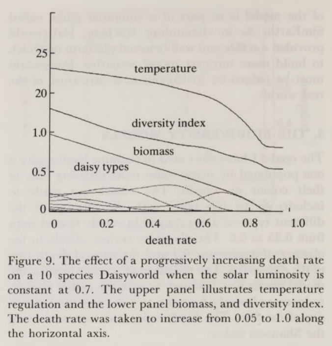
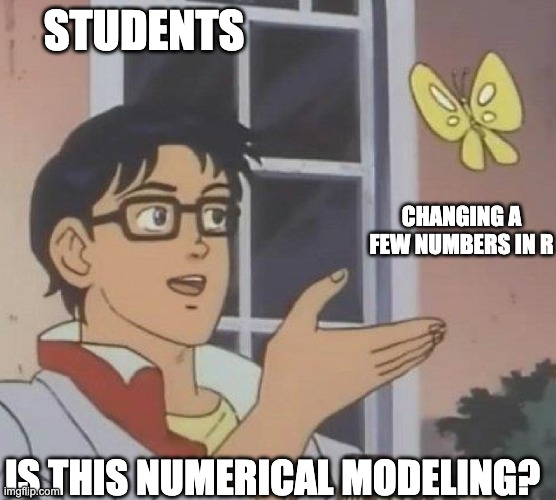

background-image: url("images/IMG_2352.jpg")
background-size: cover
class: center, top, inverse

# Simulating ecological processes

```{r xaringan-themer, include=FALSE, warning=FALSE}
### setup chunk
# load packages
library(xaringanthemer)
library(fontawesome)
library(emo)
style_duo_accent_inverse(code_highlight_color = "#cc5500",
  primary_color = "#85D3D1",
  secondary_color = "#0D2A47",
  code_inline_color = "grey",
  inverse_background_color = "#85D3D1",
  inverse_text_color = "#0D2A47",
  code_inline_background_color = "#85D3D1",
  header_font_google = google_font("Josefin Sans"),
  text_font_google   = google_font("Montserrat", "300", "300i"),
  code_font_google   = google_font("Fira Mono"),
  colors = c(orange = "#cc5500",
         teal = "#85D3D1")
)
```

```{css, echo = FALSE}

.scrollable {
  height: 300px;
  overflow-y: auto;
}


.scrollable-auto {
  height: 75%;
  overflow-y: auto;
}

.remark-slide-scaler {
    overflow-y: auto;
}
```

---
## Loops

- Loops in R are an efficient way to perform repeated actions over a defined sequence

- They follow a basic syntax that always starts with 'for', have a variable that denotes each iteration (usually denoted as a single letter), and are enclosed by curly brackets

```{r, echo = TRUE}
library(tidyverse) # load tidyverse package - you'll need it later
for (i in 1:8) {
  print(i)
}
```
- pretty simple, but also not the most useful loop
---
### More useful loops 

- Oftentimes, you will use for loops to iterate over an existing list or dataframe
- Just as often, you will actually want to store the output of your for loop in a new object
- Below we are creating abundance data for five different birds over ten years

```{r, echo = TRUE}
bird.list <- c("shearwater", # create a list of four different marine birds
               "albatross", 
               "penguin", 
               "booby") 
num.years <- 10 # create a vector that contains the number of years
lambdas <- c(10, 20, 30, 20) # create values for different poisson distributions

bird.target.data <- matrix(ncol = length(bird.list), # create an output matrix w
                           nrow = num.years) 
colnames(bird.target.data) <- bird.list # name columns

for (i in 1:length(bird.list)) { # initiate loop with i over the number of birds
  x <- rpois(10, lambdas[i]) # draw 10 values from the poisson with lambda i
  bird.target.data[,i] <- x # fill target dataset at position i with x
}
bird.target.data
```
---
# Numerical modeling
.pull-left[
- Great tool to understand the complex and dynamic nature of ecological processes

- Often involve time-stepping simulations to explore dynamics over time

- Applicable to all species in any ecosystem, including Daisyworld (Lovelock 1992, Phil Trans Roy Soc)
]

.pull-right[
```{r echo=FALSE, out.width="100%"}

```
]
---
class: center

## The Moran Model `r emo::ji("nerd_face")`

### A neutral, closed community with no evolutionary forces

Initial community of *J individuals* divided among *S species* `r emo::ji("tropical_fish")` `r emo::ji("blowfish")`

&darr;

Select one individual at random to die `r emo::ji("skull")`

&darr;

Select one individual at random to reproduce, replacing the casualty `r emo::ji("hatching_chick")`

&darr;

Rinse and repeat `r emo::ji("shower")`
---
### Running the model 

- this code was adapted from [Vellend 2016: A Theory of Ecological Communities](https://press.princeton.edu/books/hardcover/9780691164847/the-theory-of-ecological-communities-mpb-57)

```{r, echo = T, warning=FALSE, results='hide'}
num.sims <- 20 # specify the number of simulations 
num.years <- 50 # specify the number of years
freq.1.mat <- matrix(ncol = num.sims, nrow = num.years) # create a matrix for output

# FIRST LOOP FOR DIFFERENT SIMULATIONS
for (j in 1:num.sims) { # use for-loop to run through the number of simulations
  J <- 100 # 100 individuals
  t0.sp1 <- 0.5*J  # abundance of species 1 at time 0 
  community <- vector(length = J) # set up community
  community[1:t0.sp1] <- 1 # specify that half of the community is species 1
  community[(t0.sp1+1):J] <- 2 # specify the other half is species 2
  year <- 2 # set 'year' to 2 
  freq.1.mat[1,j] <- sum(community==1)/J # fill community matrix
 
  # SECOND LOOP FOR INDIVIDUAL DEATH/BIRTH
  for (i in 1:(J*(num.years-1))) {  # second for-loop to run multiple simulations
    freq.1 <- sum(community==1)/J # freq.1 represents the frequency of species 1
    pr.1 <- freq.1 # pr.1 represents the frequency of reproduction
    community[ceiling(J*runif(1))] <- sample(c(1,2), 1, prob=c(pr.1,1-pr.1))  # birth and death rates, based on probabilities
    
    
    if (i %% J == 0) { # record data in the freq.1.mat matrix 
      freq.1.mat[year, j] <- sum(community==1)/J
      year <- year + 1
    }
  }
}

colnames(freq.1.mat) <- 1:num.sims # set column names in matrix
freq.sp1.df <- as.data.frame(freq.1.mat) %>% # convert freq.1.mat into data frame 
  add_column(year = 1:num.years) # add a column called year
```
---
### Model output

- let's take a look at the output of our model

```{r, echo = TRUE}
head(freq.sp1.df)
```

- beautiful data, but we'll have to gather it if we want it to be tidy
---
### Processing and visualizing the model outputs
.pull-left[
- we can use our acquired skills in tidy data wrangling and ggplot to turn the model outputs into pretty plots

```{r, echo = TRUE}
freq.sp1.proc <- freq.sp1.df %>%
  gather(1:20, key = iteration, value = frequency)

p1 <- ggplot(freq.sp1.proc, 
             aes(x = year, 
                 y = frequency, 
                 group = iteration)) +
  geom_line(aes(color = frequency), 
            alpha = 0.8) +
  scale_color_gradient(low = "darkorchid",
                       high = "goldenrod") +
  theme_bw() +
  theme(legend.position = "none") +
  scale_y_continuous(limits = c(0,1)) +
  xlab("Years") +
  ylab("Frequency of species 1")
```
]

.pull-right[ .center[
```{r, echo = F}
p1
```
]]

---
### Changing model parameters

- let's change the number of individuals to _1000_ and the number of years to _100_

```{r, echo = TRUE}
num.sims <- 20  
num.years <- 100 # change number of years
freq.1.mat <- matrix(ncol = num.sims, nrow = num.years) # create a matrix for output

for (j in 1:num.sims) { 
  J <- 1000 # change to 1000 individuals
  t0.sp1 <- 0.5*J  
  community <- vector(length = J) 
  community[1:t0.sp1] <- 1 
  community[(t0.sp1+1):J] <- 2 
  year <- 2 
  freq.1.mat[1,j] <- sum(community==1)/J 

  for (i in 1:(J*(num.years-1))) { 
    freq.1 <- sum(community==1)/J 
    pr.1 <- freq.1 
    community[ceiling(J*runif(1))] <- sample(c(1,2), 1, prob=c(pr.1,1-pr.1))  
    
    if (i %% J == 0) { 
      freq.1.mat[year, j] <- sum(community==1)/J
      year <- year + 1
    }
  }
}
```
---
### Model results

- let's see what this produced

.pull-left[
```{r, echo = TRUE}
colnames(freq.1.mat) <- 1:num.sims 
freq.sp1.df <- as.data.frame(freq.1.mat) %>% 
  add_column(year = 1:num.years) 

freq.sp1.proc <- freq.sp1.df %>%
  gather(1:20, key = iteration, value = frequency)

p1 <- ggplot(freq.sp1.proc, 
             aes(x = year, 
                 y = frequency, 
                 group = iteration)) +
  geom_line(aes(color = frequency), 
            alpha = 0.8) +
  scale_color_gradient(low = "darkorchid",
                       high = "goldenrod") +
  theme_bw() +
  theme(legend.position = "none") +
  scale_y_continuous(limits = c(0,1)) +
  xlab("Years") +
  ylab("Frequency of species 1")
```
]

.pull-right[ .center[
```{r, echo = F}
p1
```
]]
---
class: center, middle
```{r echo=FALSE, out.width="60%"}

```
---
class: center, middle
# The end
